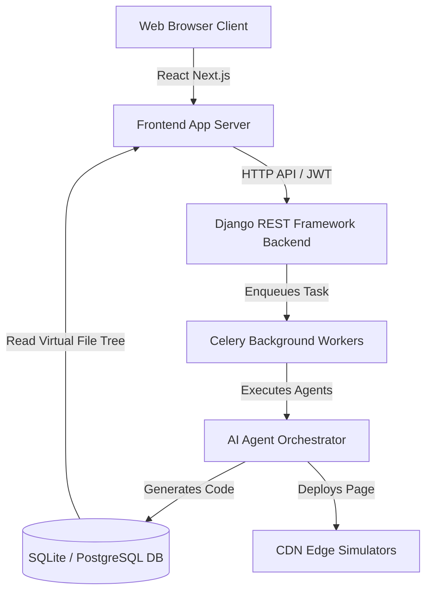

# BEVHUB AI Master Specification
## Section 02: System Architecture
Version: 1.0.0
Status: ACTIVE

================================================================================
ARCHITECTURE OVERVIEW
================================================================================
BevHubAI follows a decoupled full-stack architecture optimized for stateful, asynchronous code generation.

================================================================================
SYSTEM COMPONENTS
================================================================================

### 1. Frontend Client Application (Next.js)
- **Tech Stack**: Next.js (App Router), React, Tailwind CSS, Lucide Icons, TypeScript.
- **Port**: `:3002` (in local testing).
- **Core Sections**:
  - *Sidebar Navigation*: Workspace picker, New Project prompt, active project file tree.
  - *Main Sandbox Viewport*:
    - **Preview Page**: HTML iframe displaying the generated site (index page).
    - **Code Editor**: Text-area allowing direct edits to virtual files with autosave capability.
    - **Design Tokens**: UI preferences (writing style, language) saved to the tenant database.
    - **SaaS Billing & Credits**: Usage dashboard, billing plans, promo coupon code input, and transactions table.

### 2. Backend API Service (Django REST Framework)
- **Tech Stack**: Python, Django, DRF, SQLite/PostgreSQL, SimpleJWT.
- **Port**: `:8000` (in local testing).
- **Core Modules**:
  - `apps.core`: Custom user accounts, tenant setups, projects, virtual file systems, page models, and deployments.
  - `apps.ai`: Agent definitions, prompt builders, adapter configurations (OpenAI, Gemini), and orchestration logs.
  - `apps.billing`: Subscriptions plans, credits ledger, transactions, and promo codes.

### 3. Background Execution Engine (Celery)
- **Queue System**: Celery runs asynchronously to offload LLM orchestration from Django's HTTP loop.
- **Eager Execution Mode**: In development sandboxes, `CELERY_TASK_ALWAYS_EAGER = True` forces tasks to run synchronously in the dispatching thread, simplifying verification.

### 4. Code Generation & Virtual Filesystem
- **ProjectFile Model**: Acts as a database-driven filesystem containing `path` (e.g. `src/pages/index.html`) and `content` (string content of code files).
- **Syncing Engine**: Modifying `src/pages/*.html` automatically syncs the data back to the corresponding `Page` model in Django, triggering instant updates on the client.
