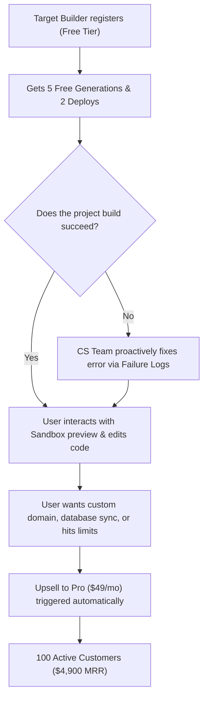

# BevHub AI: Acquisition Strategy for the First 100 Customers
**Phase 2.5 — Commercial Validation**

---

## 1. Primary Target Segment: The Solo MVP Builder & Freelance Prototype Developer

Instead of targeting "all developers" or "non-technical business owners," we focus on a highly specific group: **Solo Founders and Freelance Developers building early-stage MVPs**.

### Why This Segment?
1.  **High Pain Point:** Setting up boilerplate, frontend routing, database schemas, and dev ops takes hours or days. Solo builders need working code *instantly*.
2.  **High Tech Literacy:** They understand what React, Django, and database structures are, which means they can write high-quality prompts and evaluate the output immediately.
3.  **Low Friction to Pay:** A subscription of $49/mo is minor compared to the cost of hiring a developer or wasting 40 hours of their own time configuring boilerplate.

---

## 2. Positioning & Value Proposition

*   **Core Message:** *"From specifications to a running production-grade sandbox dev server in 60 seconds."*
*   **The Hook:** We don't just generate text; we compile the code, run standard tests, spin up an active preview workspace, and provide **Self-Repair Diagnostics** when compilation errors occur.

---

## 3. Targeted Acquisition Channels

We avoid expensive paid ads (which yield low conversion for specialized developer tools) and prioritize **high-intent organic outreach**:

### Channel A: Warm Outreach in Public Communities
*   **Indie Hackers & Reddit (`r/indiehackers`, `r/SaaS`, `r/startups`):** Search for founders posting about building prototypes, looking for technical co-founders, or struggling with tech stacks.
*   **Twitter/X Builder Community (#buildinpublic):** Actively search for developers complaining about boilerplate setup or seeking feedback on their landing pages. Pitch BevHub AI as the engine to instantly generate the backend/frontend logic for their ideas.

### Channel B: Proactive Lead Nurturing via CS Telemetry
*   When a beta user registers, our **Customer Success Dashboard** tracks their onboarding journey.
*   If the user hits a compiler drop-off or generation friction, the CS team manually reviews the **Failure Reasoning Diagnostic** and sends a personal email/message: *"Hey! I saw your build failed due to a missing TypeScript import. We fixed the configuration for you; click here to reload your workspace!"*
*   This personal feedback loop creates massive trust and dramatically improves conversion to active usage.

---

## 4. Operational Funnel: Free-to-Paid Conversion

To convert these target builders into paying customers, we structure the pricing funnel:

*   **Paid Lock Gate:** Custom domain deployment and database scaling are locked behind the $49/mo tier. As soon as an MVP needs a custom domain to show to users, the builder is forced to upgrade, validating commercial intent.
