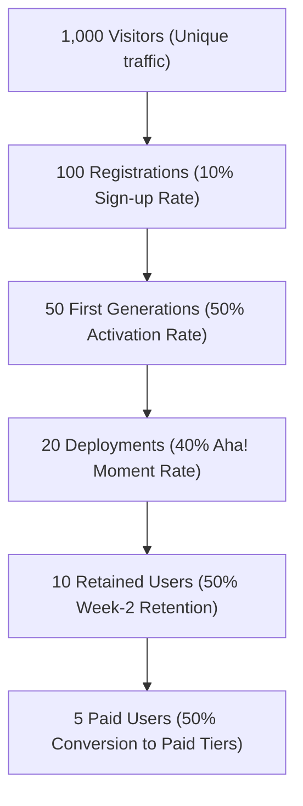

# BevHub AI: Go-To-Market (GTM) Playbook
**Phase 2.5 — Commercial Launch Framework**

This playbook establishes our acquisition strategy, funnel KPIs, channel exclusions, and the "Evidence-First" operational rules for the Closed Beta launch.

---

## 1. Target Audience Segmentation

| Segment | Pain Point | Core Messaging Hook |
| :--- | :--- | :--- |
| **Solo Developers** | Configuring boilerplate takes hours. | *"From `npm init` to active deploy sandbox in 60 seconds."* |
| **MVP Builders** | Hiring a dev is expensive; building is slow. | *"Build a functional software prototype without writing database schemas."* |
| **Agencies** | Prototyping client proposals eats profit margins. | *"Instantly generate functional drafts to win client pitches."* |
| **Startups** | Finding product-market fit requires rapid iteration. | *"Iterate features on active preview sandboxes at 1/10th developer cost."* |

---

## 2. Acquisition Funnel & Key Performance Indicators (KPIs)

Our conversion targets for organic cohort loops:



*   **Traffic to Sign-up Target:** 10.0%
*   **Sign-up to Active Generation Target:** 50.0%
*   **Active Generation to Build/Deploy (Aha! Moment):** 40.0%
*   **7-Day User Retention (Cohort Week 2):** 50.0%
*   **Active to Paid (Stripe Checkout) Target:** 50.0% of retained users.

---

## 3. Channels Strategy

### A. Primary Channels (High Dev Intent)
1.  **Reddit (`r/indiehackers`, `r/SaaS`, `r/startups`):** Participate in threads discussing tech-stack struggles. Present BevHub AI as a solution for instant functional previews.
2.  **X (Twitter) #buildinpublic:** Share real-time generation improvements, speed comparison videos, and sandbox links.
3.  **Dev.to & Hacker News:** Author technical post-mortems about building a self-repairing compiler loop. Focus on the engineering challenges and how developers can utilize the tool.
4.  **Product Hunt:** Launch high-quality video demonstrations only after reaching the first 10 paying customers in Closed Beta.

### B. Channels We Do NOT Use (Low Efficiency/High CAC)
*   **Paid Google/Meta Ads:** Excluded due to high CPC (cost-per-click) for developer keywords and poor early conversion rates.
*   **Cold Email Sequences:** Excluded to avoid spam filters and preserve domain authority; all outreach must be context-driven (evidence of user need).
*   **Generalist Startup Directories:** Low developer intent; yields low-value traffic that creates sandbox server resource drain without conversion.

---

## 4. Operational "Evidence-First" & Feature Freeze Policies

### A. The "Evidence-First" Loop
No new master specification documents or feature code blocks shall be written unless backed by real-world telemetry:

```
User friction observed in logs (e.g. 30% drop-off on SQLite setup)
       ↓
Formulate hypothesis & design experiment
       ↓
Collect metric evidence from Closed Beta dashboard
       ↓
Draft architecture/documentation for the fix
       ↓
Deploy fix
```

### B. Architecture Freeze Protocol
During the Closed Beta, major backend architectural updates are **FROZEN**. Engineering efforts are limited strictly to:
1.  **Bug Fixes:** Solving compilation failure loops.
2.  **UX Polish:** Streamlining onboarding and payment flows.
3.  **Performance Optimization:** Reducing generation latency and container spin-up times.
4.  **Security Patches:** Resolving OWASP Top 10 risks.

---

## 5. Exit Criteria: Closed Beta → Open Beta Gateway

Transition to public Open Beta is permitted **only** when all of the following checkpoints are satisfied:

| Category | Transition Metric Threshold | Current Status |
| :--- | :--- | :---: |
| **Users** | $\ge 100$ registered accounts | ⬜ |
| **Activation** | $\ge 60\%$ of users created at least one project | ⬜ |
| **Aha! Moment** | $\ge 50\%$ of users completed their first code generation | ⬜ |
| **Deployments** | $\ge 40\%$ of activated users executed at least one deployment | ⬜ |
| **7-Day Retention**| $\ge 35\%$ cohort return rate at Week 2 | ⬜ |
| **Payments** | $\ge 10$ unique active paid customers | ⬜ |
| **Uptime** | $\ge 99.5\%$ SLA verified over the trailing 30 days | ⬜ |
| **Defects** | Zero unresolved P0/P1 compiler or generation bugs | ⬜ |
| **COGS Limit** | Blended task token routing cost conforms to financial model ($< \$0.024/\text{gen}$) | ⬜ |
| **Support SLA** | Average first response time to support tickets $< 24\text{ hours}$ | ⬜ |
