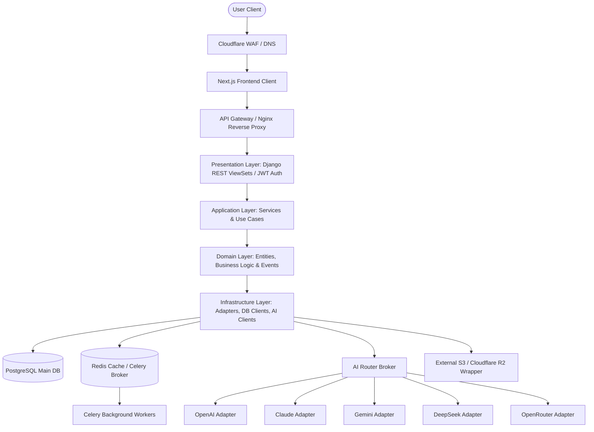

# BevHub AI — Technical Architecture Blueprint
# Version: 1.1
# Author: Technical Leadership Team (CTO, Principal Architect, Security, DevOps, UX)

---

## 1. System Vision & Objective

The mission of **BevHub AI** is to enable any entrepreneur to launch a full-featured, production-ready online business from a single prompt:

> *"One Prompt. Unlimited Possibilities."*

To deliver on this promise at a scale of 10 million users, the architecture is designed as an enterprise-grade modular monolith built with microservice readiness. The platform decouples client-side rendering from backend processing, using event-driven architectures to prevent blocking operations during heavy generation cycles.

---

## 2. High-Level Architecture

The system transitions from an client-facing portal through a secure API Gateway into a layered Python/Django Application layer, which delegates long-running tasks asynchronously via Celery and communicates with the AI Router engine.



---

## 3. Technology Stack Selection

### Frontend Stack (Separated client)
*   **Core Framework**: Next.js 14+ (App Router), TypeScript, and React.
*   **Styling & Components**: Tailwind CSS, Shadcn UI (Radix Primitives), and Framer Motion for premium micro-animations.
*   **State & Form Management**: React Query (TanStack Query) for API caching/fetching, React Hook Form, and Zod for client-side validation.
*   **Design Paradigm**: Sleek, responsive layout; no direct backend dependencies or database imports inside components. Pages are strictly presentational, deferring logic to hooks and external service modules.

### Backend Stack
*   **Core Framework**: Python 3.11+, Django, and Django REST Framework (DRF) for REST APIs.
*   **Authentication & Documentation**: JSON Web Tokens (JWT) for stateless session handling; Swagger/OpenAPI generated schemas for self-documenting APIs.
*   **Task Queue & Caching**: Celery (using Redis as the message broker) to handle non-blocking processes asynchronously.
*   **Primary Database**: PostgreSQL (configured for high availability, utilizing UUIDs for all primary keys).

---

## 4. Layered Backend Design

To guarantee microservice readiness and clean separation of concerns, the backend strictly implements the **Clean/Hexagonal Architecture** layout:

```
┌─────────────────────────────────────────────────────────┐
│ Presentational Layer (Django Views, Serializers, URLs)  │
└────────────────────────────┬────────────────────────────┘
                             ▼
┌─────────────────────────────────────────────────────────┐
│ Application Layer (Use Cases, DTOs, Event Dispatchers)   │
└────────────────────────────┬────────────────────────────┘
                             ▼
┌─────────────────────────────────────────────────────────┐
│ Domain Layer (Models, Value Objects, Domain Logic)     │
└────────────────────────────┬────────────────────────────┘
                             ▼
┌─────────────────────────────────────────────────────────┐
│ Infrastructure Layer (DB Repositories, Celery Workers,  │
│                       AI Router Adapters, S3 Storage)   │
└─────────────────────────────────────────────────────────┘
```

1.  **Presentation Layer**: Django viewsets, endpoints, serializers, OpenAPI annotations, and validation schemas. Handles requests, processes JWT authorization, and parses input.
2.  **Application Layer**: Coordinates operations, retrieves domain entities, manages transaction scopes, dispatches domain events, and triggers asynchronous jobs.
3.  **Domain Layer**: Rich domain entities. Pure business rules that do not know about database details, ORM internals, or third-party email/AI services.
4.  **Infrastructure Layer**: Handles Django ORM queries, database migrations, Celery task runners, third-party integrations (S3, Stripe, custom AI providers).

---

## 5. Database Schema & Modeling Conventions

All entities across our PostgreSQL layout adhere to strict operational guidelines:
*   **UUID Primary Keys**: Every record uses `uuid4` IDs, protecting security and making future partition/sharding migrations trivial.
*   **Auditing Fields**: Every table features `created_at`, `updated_at`, and `deleted_at` fields (for soft deletion where appropriate).
*   **Referential Integrity**: All relationships utilize foreign keys with explicitly designed deletion policies (`ON DELETE PROTECT` or `ON DELETE CASCADE` where applicable).
*   **Indexing**: Every foreign key, unique constraint, and frequently queried column (e.g. search fields, slug names) must feature custom indexes.

---

## 6. The AI Router Architecture

The **AI Router** is built using the **Adapter Pattern** to make AI providers completely interchangeable without modifying application-level use cases.

```
                  ┌──────────────────────┐
                  │   AI Router Interface│
                  └──────────┬───────────┘
                             │
       ┌─────────────────────┼─────────────────────┐
       ▼                     ▼                     ▼
┌──────────────┐      ┌──────────────┐      ┌──────────────┐
│OpenAI Adapter│      │Claude Adapter│      │Gemini Adapter│
└──────────────┘      └──────────────┘      └──────────────┘
```

*   **Abstract Core Interface**: Defines a standard API contract:
    ```python
    class BaseAIProvider(ABC):
        @abstractmethod
        async def generate_text(self, prompt: str, schema: Type[BaseModel] | None = None) -> AIResult:
            pass

        @abstractmethod
        async def generate_image(self, prompt: str) -> ImageResult:
            pass
    ```
*   **Task Decomposition Engine**: The Router parses the developer prompt, splits it into parallel tasks (e.g., SEO structure, copywriting, styling configurations), matches the tasks with the optimal provider (e.g., Claude for complex copywriting, Gemini/DeepSeek for high-volume structured layout codes), gathers responses, and synthesizes the bundle.

---

## 7. Event & Background Systems

### Event System
A pub-sub dispatcher triggers dynamic side-effects without tight-coupling. Major actions emit events which are caught by multiple listeners:
*   `UserRegistered` -> Triggers welcome email, analytics registration, and trial credit allocation.
*   `ProjectCreated` -> Establishes base project directories and triggers theme planner.
*   `WebsitePublished` -> Triggers DNS provisioning, CDN cache warmups, and sitemap generation.

### Background Queue Layout (Celery + Redis)
Long-running jobs are enqueued as Celery tasks:
*   **Media/Image Generation**: Generates high-fidelity assets without keeping the API request connection open.
*   **Deployment Pipeline**: Bundle builds and file transfers to Cloudflare R2/S3.
*   **SEO & Analytics Analysis**: Runs large content parses and site performance audits.

---

## 8. Directory & Workspace Layout

To maintain clear boundary lines between the decoupled Frontend and Backend, the monorepo features a clean separation:

```
bevhub-ai/
├── apps/
│   ├── frontend/             # Next.js web application (TypeScript, Tailwind, Shadcn)
│   └── backend/              # Python Django application (DRF, Celery, Core modules)
├── services/
│   └── workers/              # Celery worker runner & container tasks
├── packages/
│   └── database/             # Shared migrations & DB configuration scripts
├── docs/                     # Specifications, architecture plans, and OpenAPI schemas
├── SYSTEM_PROMPT_PART_01.md
├── SYSTEM_PROMPT_PART_02.md
└── README.md
```
