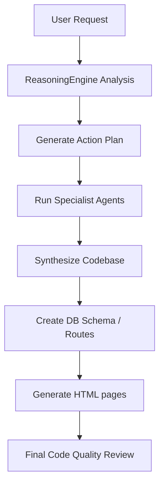

# BevHub AI Subsystem Specification — AI Orchestrator

This document provides the technical blueprint for the **AI Orchestrator** in BevHub AI.

---

## 1. Overview & Objective
The **AI Orchestrator** is the cognitive core of the platform. It coordinates the specialist agent suite, ensuring each agent produces specific data which is then merged into a functional project.
- **Cognitive Reasoning**: The ReasoningEngine runs a deterministic analysis of the prompt, selecting relevant specialists.
- **Asynchronous Execution**: Tasks execute in background threads managed by Celery.
- **Synthesized Assembly**: Captures outputs from PM, Architect, Copywriting, Branding, etc. and builds a cohesive set of pages, databases, and configuration scripts.

---

## 2. Database Model & Schema

### `AITask`
Tracks execution state, logs, and token usage for orchestration tasks.
- `id` (UUID, PK)
- `workspace` (ForeignKey to `Workspace`, CASCADE)
- `project` (ForeignKey to `Project`, CASCADE, nullable)
- `prompt` (TextField)
- `context` (JSONField for state passing between agents)
- `files` (JSONField containing list of generated file paths)
- `status` (CharField choices: `queued`, `running`, `completed`, `failed`)
- `progress` (IntegerField, 0 to 100)
- `logs` (TextField)
- `tokens_used` / `duration_ms`

---

## 3. Agent Execution Pipeline

### Specialist Agent Suite Mapping:
- **13 (Planner)**: Decides plan steps.
- **30 (Product Manager)**: Subscription box specs and features.
- **31 (Business Analyst)**: Market strategy.
- **32 (Architect)**: Structural framework details.
- **26 (Database Designer)**: DDL schemas.
- **24 (Backend Code Studio)**: API endpoint json configs.
- **18 (Branding Engine)**: Styles, fonts, colors.
- **14 (UI Designer)**: Grid dimensions, layouts.
- **36 (SEO Specialist)**: Metadata titles and descriptions.
- **37 (Copywriter)**: Brand copy and pitches.
- **27 (DevOps)**: Dockerfiles and compose setups.
- **28 (QA Engineer)**: Unit test suites.
- **33 (CTO Reviewer)**: Final code verification.

---

## 4. Synthesis Layer Specs
Once execution finishes, the orchestrator compiles:
- `README.md`: Merged summary of PM, BA, Architect, and Review logs.
- `src/database/schema.sql`: SQL schemas from DB agent.
- `src/api/routes.json`: JSON backend routes configuration.
- `src/reasoning_report.md`: System-level markdown of problem analysis and candidates.
- `src/pages/index.html` & `products.html`: Tailored layout containing copy and branding.
